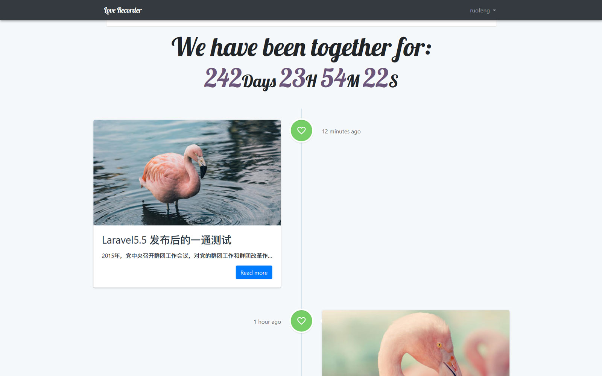
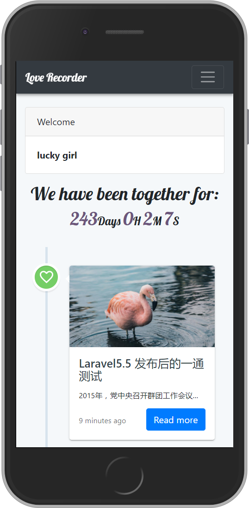

# love-recorder
---- 
```
git clone git@github.com:abowloflrf/love-recorder.git
cd love-recorder
composer install
cp .env.example .env
change the env file to specify your own secret code and your database setting
php artisan migrate
npm install
npm run dev
php artisan serve
```
Visit 127.0.0.1:8000 to view the website
### Desktop Preview
 
### Mobile Preview
