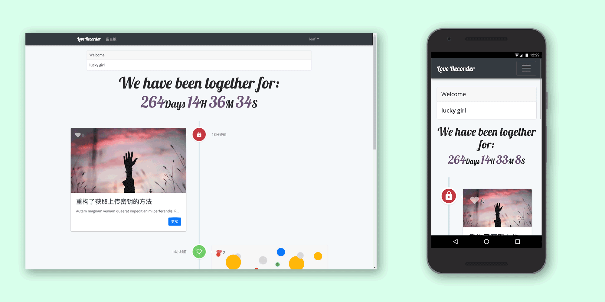

# love-recorder

为了记录我们之间生活的两三事，在17年暑假萌生了此想法，能够以时间线的形式记录我们一路走来一切值得纪念的事情。既避免了纸质笔记本的麻烦也避免了丢失的意外。

整站基于<a href="https://laravel.com/" target="_blank"><b>Laravel 5.5</b></a>,托管于<a href="https://www.vultr.com/?ref=7125603" target="_blank"><b>Vultr</b></a>LA节点服务器，所有图片均储存在<a href="https://cloud.tencent.com/" target="_blank"><b>腾讯云</b></a>万象优图上，为了避免图片上传时的二次传输，使用了腾讯云对象存储的js sdk只需要从远程服务器获取上传密钥即可从浏览器直传至腾讯云。

前端使用<a href="http://getbootstrap.com/"><b>Bootstrap-v4 beta</b></a>需要自定义的部分使用scss修改变量编译而使用。

其他依赖：

<ul>
    <li><b>Datapicker</b>: <a href="https://github.com/t1m0n/air-datepicker" target="_blank">https://github.com/t1m0n/air-datepicker</a></li>
    <li><b>Captcha</b>: <a href="https://github.com/mewebstudio/captcha" target="_blank">https://github.com/mewebstudio/captcha</a></li>
</ul>

这是本人学习PHP/Laravel后的第一个完整项目，若有不足希望给予指正。

<b>GitHub源码地址</b>：<a href="https://github.com/abowloflrf/love-recorder" target="_blank">https://github.com/abowloflrf/love-recorder</a>

同时感谢：

<ul>
    <li><b>Laravel China社区</b>：<a href="https://laravel-china.org" target="_blank">https://laravel-china.org/</a></li>
    <li><b>Laracasts</b>：<a href="https://laracasts.com" target="_blank">https://laracasts.com/</a></li>
    <li><b>Codecasts</b>：<a href="https://www.codecasts.com" target="_blank">https://www.codecasts.com/</a></li>
</ul>
<h1>当然最感谢的还是：</h1>

## Preview
 